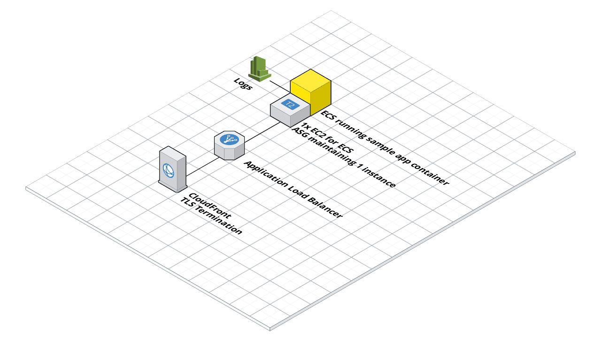
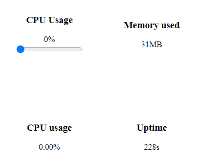

## Completion notes from Karl

Hello! You will find terraform code in the terraform directory, in this folder
you can run `terraform plan` or go straight to `terraform apply` to bring up
the stack. One of the terraform outputs will be an HTTPS URL you can use to
access the application.

If you prefer to use a different AWS profile than `default`, either supply
`TF_VAR_profile=<profile name> terraform apply`, set it in a tfvars file or
change the default in vars.tf.

Provided you haven't removed the default VPC from your AWS environment, this
should work for you - to save time I didn't create a new VPC with subnets and
routing. Destroy might take a little longer due to Cloudfront but completed
within 5 minutes in my testing.

The architecture is as follows:

These resources should all be within the free tier as requested. The decision
to use Cloudfront was driven by the free tier constraint, TLS requirement, and
the desire to keep all resources within this project. This way I was able to
get an autogenerated domain and ready-issued certificate from Cloudfront.
Normally I would implement this with ACM, Route 53 and terminate TLS at the
load balancer but route 53 is chargeable.

I would also normally allow AWS to manage the node pool for ECS with Fargate
but that is also chargeable.

Next steps (if this was a real project):

- Prevent direct access to the load balancer over HTTP using AWS-recommended
  headers, or just accept some charges and terminate TLS there instead of
  Cloudfront.

- Allow ECS to control the ASG for scale in/out behaviour.

- Possibly make a module out of it so it can be easily copied for extra
  environments, and turn more of the settings into variables in the process
  (e.g. node type, image path etc.)

- Monitoring, alerting, deployment mechanism, local environment possibly with
  docker-compose... all of the good things.

## Original README

This nodeJS application is a simple webserver to support portchain's coding challenge for the role of Devops.

Architecture
===

The web server is a single process nodeJS application that exposes a HTTP and websocket endpoint.
The web interface provides a real time view into the node process by exposing its memory and CPU 
usage as well as its uptime.

- A nodeJS application (Tested with NodeJS version 12 and 14)
- Listens to port `3000` by default but can be configured through the `PORT` environment variable
- Single process, no need to run multiple nodes

Key data points
===

- The webserver serves 2 protocols on the same port: HTTP and WebSocket.
- The port used by the webserver is `3000` by default but that can be changed with the `PORT` environment variable.
- The application logs the number of clients that are connected and the data points displayed in the UI.

Environment variables
===

- `PORT` the port number to which the  
- `NODE_ENV` set it to `production` when deployed
